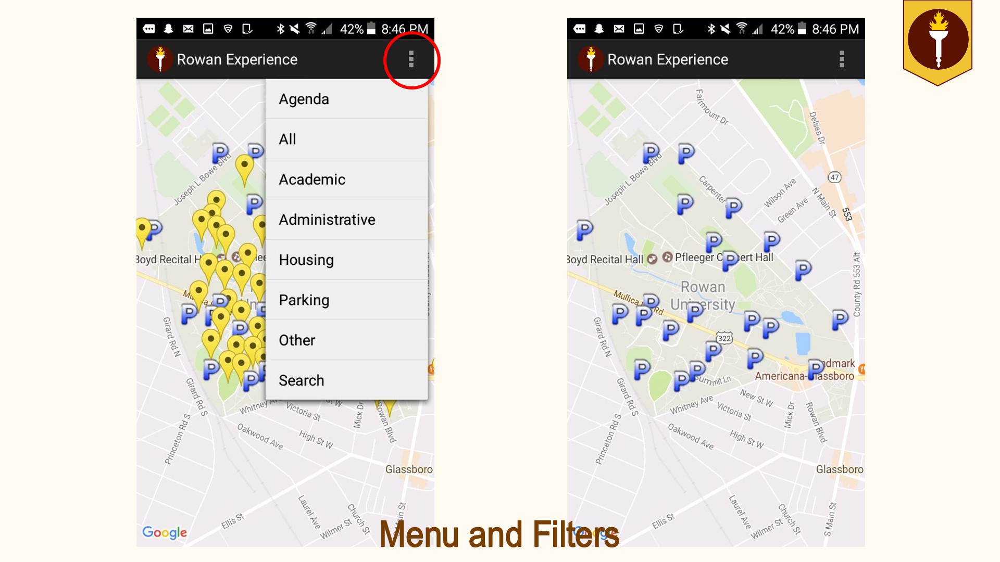
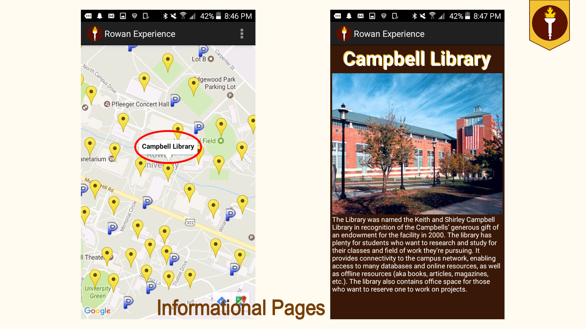
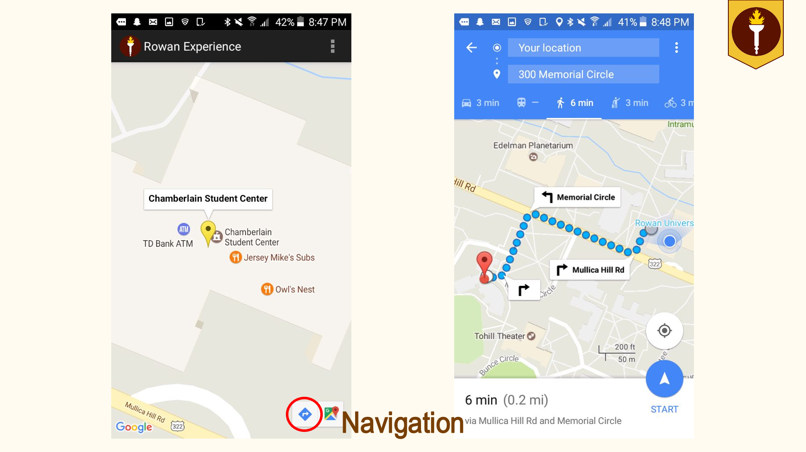
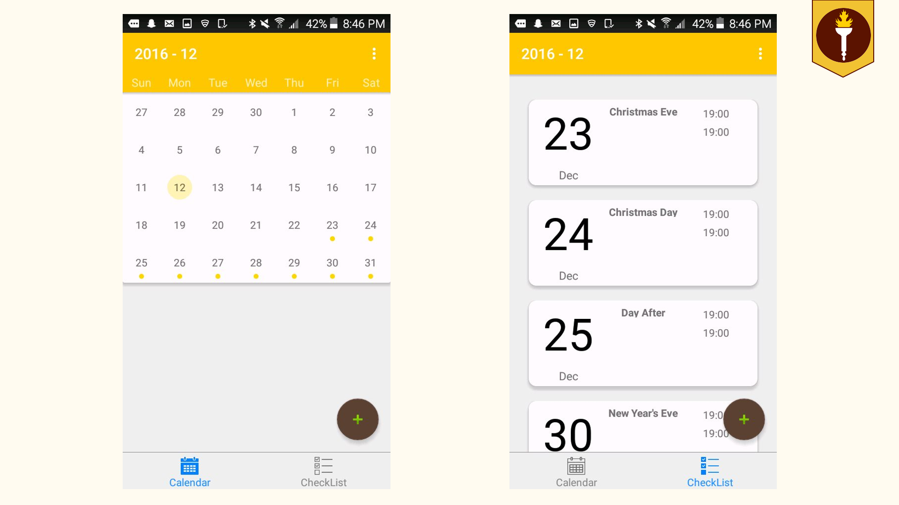
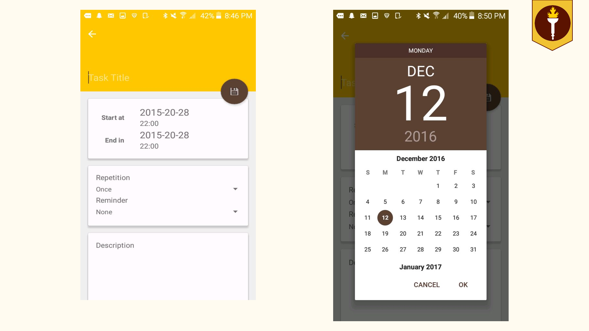

# Rowan-Experience-App
This is the Rowan Experience App. Complete Source code has not been uploaded to gitHub 

Android application utilizing Google tools to provide an interactive map of Glassboro campus
Features include:
View details of buildings/landmarks
Generate walking directions to buildings
Create calendar appointments related to specific location (e.g., a class in a specific building)

Preview of the applications can be found down below. 

